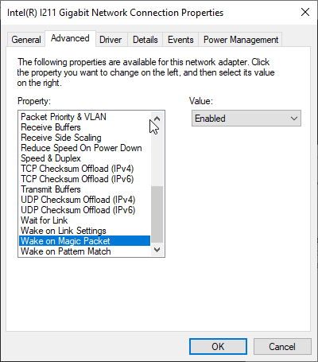
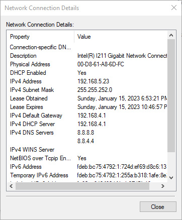
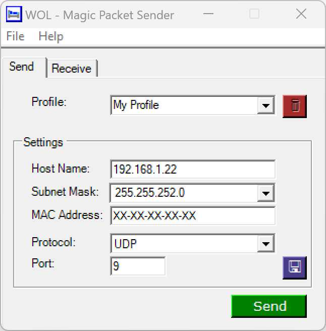

This week I ran into a remote desktop issue that turned into an interesting side project. The following project includes setting up Wake On LAN (Henceforth WOL) on windows and remotely triggering it using a ESP8266 and smart ac socket.


In the following section I will walk you through the issue I encountered as well as my.

------

## Problem

When away from home, I often find myself wanting to have access to my home network and computer using a remote desktop client. In order for this remote desktop to work as I imagine it has to be able to sleep while not in use. By allowing the PC to sleep power draw will be cut significantly when not in use.

I have typically used **AnyDesk** as my remote desktop client of choice, however I have typically achieved this with a PC that does not sleep. AnyDesk natively supports WOL, however it has the following limitation:

> "At least one additional AnyDesk device in the network of the sleeping device must be online." [^1]

This limitation makes it nearly impossible to use AnyDesk with WOL in a home setting because the lack of other devices running AnyDesk simultaneously. As a result, I needed to come up with another solution.


## Solution

After giving the issue some thought, it came to mind that I could use another device on the network to be triggered remotely in order to send the "Magic Packet" to the PC.  In order to achieve this I would need another device always on, and thus significant power draw in order to have the ability to wake a device up. This seemed excessive.  After some more research I decided to use a smart AC plug that I can trigger remotely through a cloud app to turn on a device that would send the message. In order to get this up and running quickly as well as keep the physical footprint of the solution down, I ended on an ESP8266.


### Materials Backgound


#### Wemos D1 Mini (ESP8266)


The Wemos D1 Mini which based around the ESP8266 has the following features:

- 11 digital IO, interrupt/pwm/I2C/one-wire support
- 1 analog input
- Micro-USB Port (Power/Programming Interface)
- Compatible with MicroPython, Arduino, and nodemcu

Additional Specs:

- 4MB Flash
- Length: 34.2mm
- Width: 25.6mm
- Weight: 10g


#### Shelly Smart Plug US


The Shelly PlugUS is a smart home device which plugs into a standard IEC Type B socket and provides a IEC Type B plug that can be wirelessly controlled. The most Shelly devices, including the Plug US, support many different forms of communication including:

- MQTT

- SmartThings

- Home Assistant

- REST

- OpenHAB

  and others

Additionally the shelly IOS application allows for remote triggering using their built in cloud service.

Another interesting feature of the smart plug is it's power monitoring system. This power monitoring system can provide many useful insights into power consumption of specific devices/systems.


## WOL Setup

In order to get WOL working the PC needed to have both the BIOS and windows ethernet adapter settings.


### BIOS Configuration

To configure your motherboard to allow WOL packets enter the BIOS and Enable the setting "Wakeup On LAN". This setting may appear under an advanced tab or under power management. If Wakeup On LAN is **not** an option, look for and enable "Resume By PCI-E Device".


### Network Driver Configuration

Once the BIOS has been configured, the windows network adapter setting have to be adjusted.

1. Navigate to the Control Panel > Network and Internet > Network Connections and right-click on the Ethernet adapter.

2. From the right-click menu select Properties. From the window that opens, click the Configure button in the upper right followed by the Advanced tab.

3.  Under the Advanced tab, scroll through the properties until you locate "Wake on Magic Packet" and then set the Value to Enabled.
    
4. Click ok to save and exit

5. Next, under the same location in the Control Panel > Network and Internet > Network Connections, right-click on the Ethernet adapter and select Status from the right-click menu.

6. Select the Details button under connection and take note of the "Physical Address" value that is displayed in the popup.
   

## WOL Testing

To test that everything has been configured properly, download WOL - Magic Packet Sender from http://magicpacket.free.fr/ onto a separate device. Once installed, launch the program and configure the following settings:

- Host Name: the ipAddress or host name of the device you wish to wake up
- Subnet Mask: the specific mask for your local network
- MAC Address: the "Physical Address" noted from step 6 in Network Driver Configuration
- Protocol: UDP
- Port: 9 (usually port 9 but may differ)
  

Set the device that has been configured for WOL to sleep. Once the device has fully gone to sleep (Hint - Fans off) click the send button in the Magic Packet Sender Application. You should now observe the PC being woken up from sleep.


## Integration with Wemos D1 Mini (ESP8266)

The following steps assume you have experience with the Arduino IDE and have the Board Libraries for the ESP8266 installed properly

1. Find and download the library from Ahmed Naser on GitHub: WakeOnLan https://github.com/a7md0/WakeOnLan

2. In the arduino IDE, select Sketch > Include Library > Add .ZIP Library and locate the downloaded GitHub project.

3. Copy and paste the following code into the IDE

   ```c showLineNumbers
   #include <ESP8266WiFi.h>
   #include <WiFiUdp.h>
   WiFiUDP UDP;
   
   #include <WakeOnLan.h>
   WakeOnLan WOL(UDP); // Pass WiFiUDP class
   
   const char* ssid = "Wifi SSID";
   const char* password = "wifipassword";
   const char *MACAddress = "XX-XX-XX-XX-XX-XX";
   
   void setup_wifi() {
   
     delay(10);
     // We start by connecting to a WiFi network
     Serial.println();
     Serial.print("Connecting to ");
     Serial.println(ssid);
   
     WiFi.mode(WIFI_STA);
     WiFi.begin(ssid, password);
   
     while (WiFi.status() != WL_CONNECTED) {
       delay(500);
       Serial.print(".");
     }
   
     randomSeed(micros());
   
     Serial.println("");
     Serial.println("WiFi connected");
     Serial.println("IP address: ");
     Serial.println(WiFi.localIP());
     WOL.calculateBroadcastAddress(WiFi.localIP(), WiFi.subnetMask());
   
     WOL.sendMagicPacket(MACAddress);
     Serial.println("Sending Magic Packet to ");
     Serial.print(MACAddress);
     Serial.println("From ");
     Serial.print(WiFi.localIP());
     Serial.print("  -  ");
      Serial.print(WiFi.subnetMask());
   }
   
   void setup() {
     // put your setup code here, to run once:
      Serial.begin(115200);
      setup_wifi();
   
      WOL.setRepeat(3, 100); // Repeat the packet three times with 100ms delay between
   }
   
   void loop() {
     // put your main code here, to run repeatedly:
   
   }
   ```

4. Edit the code on line 8-10 to match you specific network credentials and the Mac Address of the device to wake up

5. Plug in the Wemos D1 Mini device, select the correct port, and click upload button.

   Note: This code is designed to send the magic packet as soon as the ESP8266 has connected to the local network.

## Final Setup

Note: I will not be going over how to setup a Shelly Plug US with the Shelly App.

1. Plug the Shelly Plug US into a wall socket

2. Plug a AC to USB Type A adapter into the Shelly Plug US

3. Plug a USB Type A to USB Micro B cord into the USB adapter

4. Finally, plug the Wemos D1 Mini into the Micro USB cord.

5. Open the Shelly App and toggle power to the Shelly Plug US


[^1]: See anydesk.com help center knowledge base for more information. https://support.anydesk.com/knowledge/wake-on-lan

