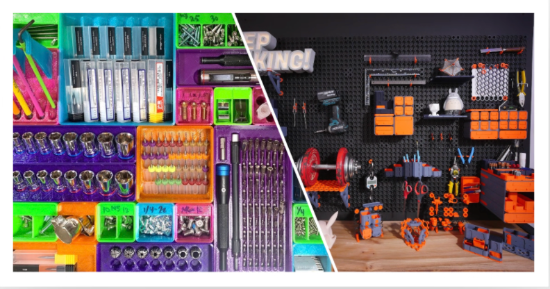

Staying organized in my hobby space has always been challenging, especially when my collection of tools and supplies 
continue to grow as I take on new projects. Thankfully, 3D printing is one of my hobbies and because of its 
versatility, and community of makers, I've found that it can be a great tool for organizing my space. Throughout my 
search, Gridfinity and MultiBoard have revealed themselves as two of the most popular 3D printed systems for 
organization. After careful consideration, I decided to go with MultiBoard and here's why, and how you can find the 
best 3D-printed organization system for your needs.

<!-- truncate -->

-----
## Understanding the Basics: Gridfinity vs. MultiBoard

Before diving into why I chose MultiBoard, it's important to understand what each system offers:

Gridfinity is a modular storage system that uses a grid-based approach. The system is designed around a consistent grid
size, allowing you to print various bins, trays, and holders that snap into place on a baseplate. It’s known for its
simplicity, ease of use, and wide array of community-made designs.

MultiGrid, on the other hand, takes a similar approach but offers more flexibility in its layout. Instead of adhering
strictly to one grid size, MultiGrid allows users to create custom baseplates with different configurations. It
maintains compatibility with some aspects of the Gridfinity system but is generally more open to different design styles
and use cases.

Why Go with a 3D Printed Organization System?
Both Gridfinity and MultiGrid have become popular for a few key reasons:

Customization: You can print exactly what you need. Need a bin with slots for small screws? Done. Want a holder for
pliers and tweezers? Easy.
Modularity: The ability to rearrange and expand your storage as your needs change is invaluable. These systems allow you
to grow your setup without starting over.
Affordability: Compared to commercial modular storage solutions, printing your own with a 3D printer can save a
significant amount of money, especially if you already have a printer at home.
Why I Chose MultiGrid Over Gridfinity
After researching both systems and printing a few test pieces, I found that MultiGrid better suited my specific needs.
Here are the key reasons why I opted for MultiGrid:

1. Flexibility in Layout and Design
   The biggest advantage of MultiGrid is its flexibility. While Gridfinity’s uniformity is a strength, it can be
   limiting if you need storage solutions that don't quite fit the standard grid size. MultiGrid offers the ability to
   design and customize baseplates with varied dimensions, which was a game-changer for my space. For example, I have a
   few oddly shaped drawers and shelves where I wanted to fit a storage grid, and MultiGrid allowed me to create
   custom-sized baseplates that fit perfectly.

2. Custom Compatibility with Existing Tools
   One of my goals was to integrate my 3D-printed organization system with existing tools and storage containers I
   already had. MultiGrid’s design allows for easier adaptation and mixing of different storage units. I was able to
   design custom holders for specific tools, like calipers and precision screwdrivers, that slot seamlessly into the
   MultiGrid baseplates. This wouldn’t have been as straightforward with Gridfinity’s more rigid layout.

3. Enhanced Aesthetic Appeal
   While functionality is the primary consideration, I also wanted a system that looked cohesive and professional in my
   workspace. MultiGrid allowed me to design and print storage units with different heights and styles while still
   maintaining a unified look. It’s great to have a system that not only keeps everything organized but also looks clean
   and well-thought-out.

4. Community and Customization Potential
   The maker community behind MultiGrid is vibrant and continues to grow, offering new designs and ideas. This means
   that if I need a particular holder or bin, I can often find something already designed or make minor tweaks to an
   existing model. The flexibility to modify designs to fit my needs has been a huge benefit. Gridfinity’s designs are
   versatile, but MultiGrid’s open approach made it easier for me to create truly custom solutions.

How to Choose the Right System for Your Needs
If you're on the fence about which system to go with, here are some things to consider:

Assess Your Space: Measure your storage areas and determine whether a strict grid system will fit. If you have irregular
spaces, MultiGrid’s customization might be the better choice.
Identify Your Tools and Components: List out what you need to store. Gridfinity is great if you need lots of
uniform-sized bins, but if you have a mix of small tools, large components, and unique items, MultiGrid might offer the
adaptability you need.
Look for Community Support: Check out online forums and communities like Thingiverse or Printables. See what designs are
available and how active each system’s community is. This can be a good indicator of how easy it will be to find new
designs and inspiration.
Test with a Few Prints: If you have a 3D printer, try printing a few small pieces from each system to see which feels
better in your space. You’ll get a sense of the build quality and how each system meets your needs.
My MultiGrid Setup: A Practical Example
To give you a sense of how MultiGrid has worked for me, here’s a breakdown of my current setup:

Custom Baseplates: I printed several baseplates tailored to different shelves and drawers. Each baseplate fits snugly,
maximizing the available space.
Tool Holders: I designed and printed holders for pliers, precision screwdrivers, and drill bits that click into place.
The holders are at varying heights, making it easy to grab the right tool without digging through bins.
Small Parts Bins: For things like screws, nuts, and electronic components, I printed small bins that fit into a section
of my MultiGrid baseplate. Each bin has a label, making it easy to identify contents at a glance.
Conclusion: MultiGrid Offers Customization for the Perfect Fit
Choosing the right 3D-printed organization system can be a game-changer for anyone looking to optimize their workspace.
While Gridfinity is a great option with a strong community behind it, I found that MultiGrid’s flexibility and
customization potential made it a better fit for my needs. If you’re looking for a system that can adapt to unique
spaces and specific tools, MultiGrid might just be the solution you’ve been searching for.

Happy printing, and may your workshop be forever organized!