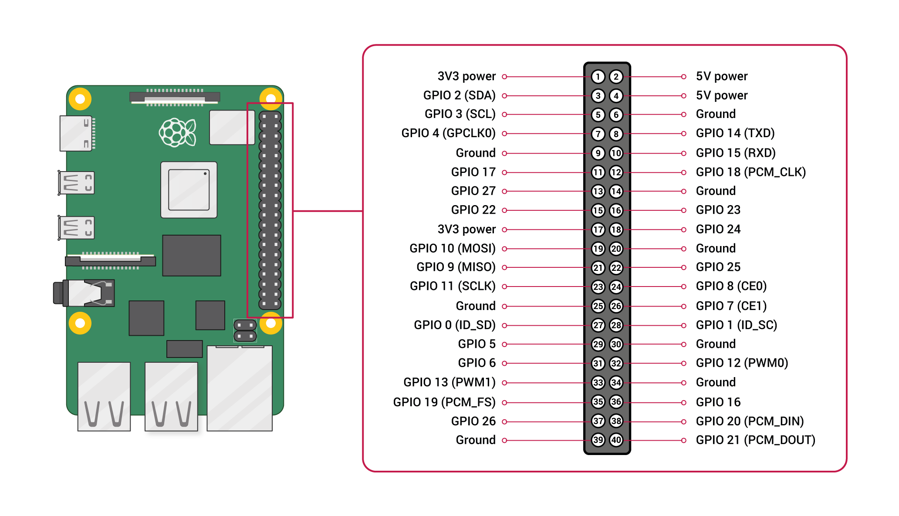

# RPI as ESP Programmer
## Software Requirements

### ESPTool Dependencies

First run the following command with the `sudo` command prefix to get the latest stable esptool release.
```bash
sudo pip install esptool
```

Next, navigate to a directory in which you wish to install the esptool script. For this document the location will be `home/pi`. And run the following command.
```bash
git clone https://github.com/espressif/esptool.git
```
Once the repository is cloned, the esptool will be available for use.

### Raspberry Pi OS Requirements

In order for the pi to communicate with the ESP32, serial must be enabled in the `raspi-config` menu. Enter the following command to open the menu.
```bash
sudo raspi-config
```
Next, select **interfacing options** followed by **Serial Port** and then **Yes** to enable use of the serial port. To exit the  `raspi-config` menu, click the right arrow on the keyboard until **Back** is highlighted on the screen followed by enter. You should now be back in the main menu. Click right arrow again until **Finish** is highlighted then click enter.


## Physical Requirements
To electrically connect the Raspberry Pi to the ESP32 Chip, the following three lines need to be connected from the 40 pin GPIO header:
- GPIOP 14 (TXD) - Pin 8
- GPIO 15 (RXD) - Pin 10
- Ground (GND) - Pin 6,9,14,20,25,30,34, or 39
  
  The following shoes a rudimentary wiring diagram of the electrical connections between the two devices. You may notice that **IO0** is tied to ground which tells the EPS32 to enter the serial bootloader.
  

## Flashing the ESP32

```bash
sudo esptool.py --chip esp32 --port /dev/ttyUSB1 -b 921600 --before default_reset --after hard_reset write_flash -z --flash_mode dio --flash_freq 80m --flash_size detect 0xe000 /home/pi/boot_app0.bin 0x1000 /home/pi/app.ino.bootloader.bin 0x10000 /home/pi/app.ino.bin 0x8000 /home/pi/app.ino.partitions.bin
```
## Additional Information
###### For more information see the following links
###### - https://docs.espressif.com/projects/esptool/en/latest/esp32/esptool/index.html
###### - https://docs.espressif.com/projects/esptool/en/latest/esp32/advanced-topics/boot-mode-selection.html
