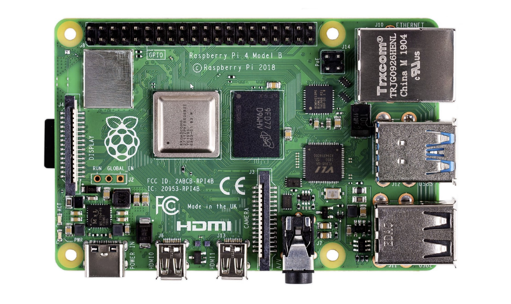
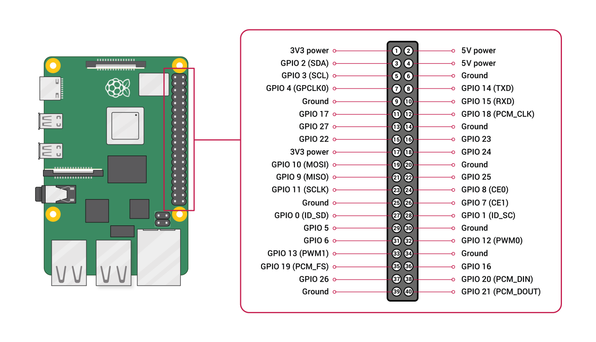

---  
sidebar_position: 1
---  
# Raspberry Pi Overview


##  RPI 4 Specifications

|      |  |
| ----------- | ----------- |
| Processor      | Broadcom BCM2711, quad-core Cortex-A72 (ARM v8) 64-bit SoC @ 1.5GHz       |
| Memory   | 1GB, 2GB, 4GB or 8GB LPDDR4 (depending on model) with on-die ECC        |
| Connectivity | 2.4 GHz and 5.0 GHz IEEE 802.11b/g/n/ac wireless LAN, Bluetooth 5.0, BLE Gigabit Ethernet, 2 × USB 3.0 ports, 2 × USB 2.0 ports.|
| GPIO | Standard 40-pin GPIO header (fully backwards-compatible with previous boards) |
| Video & sound | 2 × micro HDMI ports (up to 4Kp60 supported), 2-lane MIPI DSI display port, 2-lane MIPI CSI camera port, 4-pole stereo audio and composite video port |
| SD card support | Micro SD card slot for loading operating system and data storage|
| Input power | 5V DC via USB-C connector (minimum 3A), 5V DC via GPIO header (minimum 3A), Power over Ethernet (PoE)–enabled (requires separate PoE HAT) |
| Environment | Operating temperature 0–50ºC |
| Compliance | For a full list of local and regional product approvals, please visit https://www.raspberrypi.org/documentation/hardware/raspberrypi/conformity.md |
| Production lifetime | The Raspberry Pi 4 Model B will remain in production until at least January 2026. |

### Raspberry Pi 4 Changes


## IO
The Raspberry Pi has two rows of GPIO pins along the top edge of the board. GPIO stands for General-Purpose Input/Output.
> “These pins are a physical interface between the Raspberry Pi and the outside world. At the simplest level, you can think of them as switches that you can turn on or off (input) or that the Pi can turn on or off (output)” - Raspberry Pi Foundation



|  Pin Category | Pin Functionality |
| ----------- | ----------- |
| GPIO | GPIO pins are standard general-purpose pins that can be used for turning external devices, such as an LED, on or off. |
| Power | 5V and 3V3 pins are used to supply 5V and 3.3V power to external components. |
| I2C | I2C pins are used for connecting and hardware communication purposes with I2C compatible external modules. |
| SPI | SPI (Serial Peripheral Interface Bus) pins are also used for hardware communication, but with a different protocol. |
| UART | UART (Universal Asynchronous Receiver / Transmitter) pins are used for serial communication. |
| GND | GND (Ground) pins refer to pins that provide electrical grounding in your circuits. |

### GPIO Pinout
The `pinout` command is a useful tool to reference when working with a Raspberry Pi. `pinout` is provided by the GPIO Zero Python library and comes installed by default on Raspberry Pi OS distributions. Running the `pinout` command will return an output similar to that shown below. The output gives a useful visualization of the raspberry pi board and all its connectors, as well as a quick reference pinout of the 40-pin header.
```Palenight  
pi@raspberrypi:~ $ pinout  
,--------------------------------.  
| oooooooooooooooooooo J8   +======  
| 1ooooooooooooooooooo  PoE | Net  
| Wi                     1o +======  
| Fi  Pi Model 4B V1.5   oo      |  
|      ,----.     +---+       +====  
| |D|  |SoC |     |RAM|       |USB3  
| |S|  |    |     |   |       +====  
| |I|  `----'     +---+          |  
|                   |C|       +====  
|                   |S|       |USB2  
| pwr   |hd|   |hd| |I||A|    +====  
`-| |---|m0|---|m1|----|V|-------'  
  
Revision           : b03115  
SoC                : BCM2711  
RAM                : 2GB  
Storage            : MicroSD  
USB ports          : 4 (of which 2 USB3)  
Ethernet ports     : 1 (1000Mbps max. speed)  
Wi-fi              : True  
Bluetooth          : True  
Camera ports (CSI) : 1  
Display ports (DSI): 1  
  
J8:  
   3V3 (1) (2) 5V  
 GPIO2 (3) (4) 5V  
 GPIO3 (5) (6) GND  
 GPIO4 (7) (8) GPIO14  
   GND (9) (10) GPIO15  
GPIO17 (11) (12) GPIO18  
GPIO27 (13) (14) GND  
GPIO22 (15) (16) GPIO23  
   3V3 (17) (18) GPIO24  
GPIO10 (19) (20) GND  
 GPIO9 (21) (22) GPIO25  
GPIO11 (23) (24) GPIO8  
   GND (25) (26) GPIO7  
 GPIO0 (27) (28) GPIO1  
 GPIO5 (29) (30) GND  
 GPIO6 (31) (32) GPIO12  
GPIO13 (33) (34) GND  
GPIO19 (35) (36) GPIO16  
GPIO26 (37) (38) GPIO20  
   GND (39) (40) GPIO21  
  
POE:  
  TR01 (1) (2) TR00  
  TR03 (3) (4) TR02  
  
For further information, please refer to https://pinout.xyz/  
  
```
## Additional Information
###### For more information see the following links
###### - https://pinout.xyz
###### - https://www.raspberrypi.com/products/raspberry-pi-4-model-b/specifications/
###### - https://gpiozero.readthedocs.io/en/stable/index.html